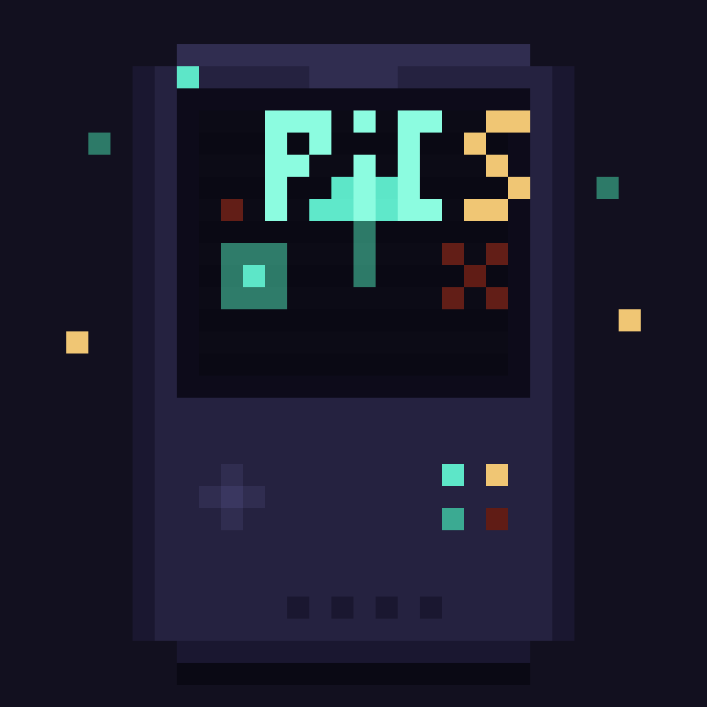

# PicS ⚔️

> 滑一滑，轻松释放空间 — Dungeon Pixel Edition

**PicS** 是一款 iOS 原生照片/视频快速清理工具。通过沉浸式的全屏滑动体验，像刷短视频一样快速清理手机中不需要的照片和视频。V1.2 Dungeon Edition 带来全面像素 RPG 主题视觉升级。

<p align="center">
  
</p>

## ✨ 核心特性

### 📷 照片模式
- **上滑保留** — 喜欢的照片向上滑
- **左滑删除** — 不要的照片向左滑
- **下滑回看** — 想重新看上一张，向下滑
- **快速轻甩** — 速度检测，轻甩即可触发动作
- **边缘光晕** — 柔和的绿色/红色渐变提示滑动方向

### 🎬 视频模式（抖音式交互）
- **上下滑动** — 切换视频，沉浸式浏览
- **点击暂停** — 点击视频暂停/继续，暂停时显示播放图标
- **进度拖拽** — 底部可拖拽进度条，精确定位
- **长按加速** — 长按 0.3s 进入 2x 倍速播放
- **有声播放** — 默认有声，右下角可切换静音
- **右侧按钮** — 删除标记后自动跳到下一个视频

### 🔍 筛选清理（V1.2）
- **截图筛选** — 快速定位所有屏幕截图
- **大文件优先** — 优先展示 >10MB 的文件
- **时间范围** — 按年份/自定义日期筛选
- **相册选择** — 指定相册范围清理

### ⚔️ Dungeon Pixel 主题（V1.2）
- **Press Start 2P 像素字体** — 标题、数字、按钮标签
- **HP Bar 分段进度条** — 存储空间可视化
- **边框发光按钮** — 替代渐变填充
- **RPG 文案** — START、QUEST COMPLETE、HP BAR、ESC
- **地牢风格卡片** — 边框式代替填充式

### 🛡️ 安全第一
- 📵 **纯本地运行** — 无网络请求，零数据上传
- 🗑️ **可恢复删除** — 照片/视频移至系统「最近删除」，30 天内可恢复
- 🔒 **最小权限** — 仅请求相册读写权限

## 📸 界面预览

### 核心交互流程

```
┌─────────────────────────────────────────────────────────────────────┐
│                         PicS 用户旅程                               │
│                                                                     │
│  ⚔️ Welcome    →    📖 Tutorial    →    🔑 Permission               │
│  ┌──────────┐     ┌──────────┐      ┌──────────┐                   │
│  │  PicS    │     │ ↑ 上滑    │      │ 授权相册  │                   │
│  │ ✦✦✦✦✦   │ ──▶ │ = 保留   │ ──▶  │          │                   │
│  │ [START]  │     │ ← 左滑    │      │ [授权]   │                   │
│  └──────────┘     │ = 删除   │      └────┬─────┘                   │
│                   └──────────┘           │                          │
│                                          ▼                          │
│  ┌──────────────────────────────────────────────────────────┐      │
│  │                    🏠 Home Dashboard                      │      │
│  │  ┌────────────────────────────────────────────────┐      │      │
│  │  │  ⚔️ PicS        ✦ ✦ ✦ ✦ ✦                     │      │      │
│  │  │  ⚔️ 相册清理 · 地牢探索                          │      │      │
│  │  └────────────────────────────────────────────────┘      │      │
│  │  ┌─ HP BAR ──────────────────────────────────────┐      │      │
│  │  │  ██ ██ ██ ██ ██ ██ ██ ░░ ░░ ░░  68.2GB/128GB │      │      │
│  │  └───────────────────────────────────────────────┘      │      │
│  │  ┌────────────────────────────────────────────────┐      │      │
│  │  │  ▶ START                                       │      │      │
│  │  │  随机抽取 20 张照片                              │      │      │
│  │  └────────────────────────────────────────────────┘      │      │
│  │  ┌──────┐ ┌──────┐ ┌──────┐ ┌──────┐                    │      │
│  │  │ 📷   │ │ 🎬   │ │ 🧹   │ │ ⚙    │                    │      │
│  │  │12702 │ │ 2178 │ │389MB │ │      │                    │      │
│  │  │ 照片 │ │ 视频 │ │已释放 │ │ 设置 │                    │      │
│  │  └──────┘ └──────┘ └──────┘ └──────┘                    │      │
│  └──────────────────────────────────────────────────────────┘      │
│                          │                                          │
│              ┌───────────┼───────────┐                              │
│              ▼           ▼           ▼                              │
│  ┌──────────────┐ ┌───────────┐ ┌──────────┐                      │
│  │ 📷 照片滑动   │ │ 🎬 视频模式│ │ 🔍 筛选   │                      │
│  │              │ │           │ │          │                      │
│  │  ← ESC      │ │   [▲]     │ │ 截图/大文件│                      │
│  │    5/20     │ │   [▼]     │ │ 时间/相册  │                      │
│  │  ┌────────┐ │ │  ┌─────┐  │ │          │                      │
│  │  │  📷    │ │ │  │ 🎬  │  │ │ 符合 42  │                      │
│  │  │        │ │ │  │     │  │ │ [开始清理]│                      │
│  │  └────────┘ │ │  └─────┘  │ └──────────┘                      │
│  │  ▒▒▒▒░░░░░░ │ │   🗑️ ↩️   │                                    │
│  └──────┬───────┘ └─────┬─────┘                                    │
│         └───────┬───────┘                                          │
│                 ▼                                                    │
│  ┌──────────────────────────────────────────────────────────┐      │
│  │              ❌ 确认删除                                   │      │
│  │  ┌──────────────────────────────┐   ┌────┐               │      │
│  │  │    📷 照片预览                │   │1/3 │               │      │
│  │  │    (左右滑动查看)             │   │撤回│               │      │
│  │  └──────────────────────────────┘   └────┘               │      │
│  │  ● ○ ○   预计释放 13.8 MB                                │      │
│  │  [确认删除 3 张照片]                                       │      │
│  │  再来一组    全部撤回                                      │      │
│  └──────────────────────────────────┬───────────────────────┘      │
│                                      ▼                              │
│  ┌──────────────────────────────────────────────────────────┐      │
│  │            ✦ QUEST COMPLETE ✦                             │      │
│  │                   🏆                                      │      │
│  │                  ✓ / 🗑️                                   │      │
│  │                                                           │      │
│  │                已清理                                      │      │
│  │                  9                                        │      │
│  │                张照片                                      │      │
│  │                                                           │      │
│  │          + 13.8 MB  FREED                                 │      │
│  │                                                           │      │
│  │          [HOME]    [NEXT ▶]                               │      │
│  └──────────────────────────────────────────────────────────┘      │
└─────────────────────────────────────────────────────────────────────┘
```

### 关键页面一览

| 页面 | 说明 | RPG 元素 |
|:---:|:---:|:---:|
| 🏠 首页 | HP Bar + START 按钮 | 像素字体、分段进度条 |
| 📷 照片滑动 | 上滑保留 / 左滑删除 | ESC 返回、像素进度条 |
| 🎬 视频模式 | 抖音式上下切换 | 像素计数器 |
| ❌ 确认删除 | 预览 + 撤回 | 像素标题、渐变按钮 |
| 🏆 结果页 | QUEST COMPLETE | 像素数字、FREED 徽章 |
| ⚙️ 设置 | SETTINGS 分组 | GENERAL / STATS / ABOUT |

## 🏗️ 技术栈

| 技术 | 说明 |
|------|------|
| **Swift 5.9+** | 编程语言 |
| **SwiftUI** | UI 框架（iOS 17+） |
| **PhotoKit** | 相册访问（PHAsset） |
| **AVFoundation** | 视频播放（AVPlayer） |
| **SwiftData** | 本地持久化 |
| **MVVM** | 架构模式 |
| **@Observable** | Swift 5.9 观察宏 |
| **Press Start 2P** | 像素字体（Google Fonts, OFL） |

## 📂 项目结构

```
PicSwipe/
├── Assets.xcassets/        — 应用图标
├── Fonts/                  — 自定义字体
│   └── PressStart2P-Regular.ttf
├── App/                    — App 入口
├── Views/                  — SwiftUI 视图
│   ├── DesignSystem.swift  — 设计系统（色彩、字体、组件）
│   ├── Home/               — 首页仪表盘
│   ├── Swipe/              — 滑动浏览（核心）
│   │   ├── SwipeView       — 手势控制器
│   │   ├── SwipeCardView   — 卡片展示
│   │   └── VideoPlayerView — 增强视频播放器
│   ├── ConfirmDelete/      — 确认删除（照片/视频双布局）
│   ├── Result/             — 结果动效页
│   ├── Filter/             — 筛选清理页
│   ├── Settings/           — 设置页
│   └── Onboarding/         — 引导流程
├── ViewModels/             — MVVM 视图模型
├── Models/                 — 数据模型
└── Services/               — 业务逻辑
    ├── PhotoLibraryService — 相册读写（后台线程）
    ├── StorageService      — 设备存储
    ├── StatisticsService   — 清理统计
    └── HapticService       — 触觉反馈
```

## 🎨 设计系统

### Dungeon Pixel 色彩

| Token | 色值 | 用途 |
|-------|------|------|
| `brandPrimary` | `#5DE6C8` | 柔青绿 — 主色调 |
| `brandSecondary` | `#3BAA92` | 深青 — 辅色 |
| `appBackground` | `#12101F` | 深藏青 — 背景 |
| `destructiveRed` | `#C0392B` | 深红 — 删除/警告 |
| `warningYellow` | `#F0C674` | 琥珀 — XP/释放空间 |

### 像素字体

- **Press Start 2P** — 用于标题、数字、按钮标签等 RPG 元素
- **系统字体** — 用于中文正文（Press Start 2P 不支持中文）

### 组件

| 组件 | 说明 |
|------|------|
| `PrimaryButton` | 边框发光按钮（brandPrimary 边框 + 半透明背景） |
| `DungeonCard` | 边框式卡片容器 |
| `HPBar` | 分段 HP 条（10 段，按剩余百分比变色） |
| `CardContainer` | 通用边框式卡片 |

## 🚀 快速开始

### 环境要求

| 项目 | 最低版本 |
|------|----------|
| macOS | 14.0 (Sonoma) |
| Xcode | 15.1+ |
| iOS | 17.0 |
| Swift | 5.9+ |

### 构建运行

```bash
# 克隆仓库
git clone https://github.com/floki-u/PicSwipe.git
cd PicSwipe

# 打开 Xcode 项目
open PicSwipe.xcodeproj

# 命令行构建
xcodebuild -scheme PicSwipe -destination 'platform=iOS Simulator,name=iPhone 16' build

# 运行测试
xcodebuild test -scheme PicSwipe -destination 'platform=iOS Simulator,name=iPhone 16' -only-testing:PicSwipeTests
```

### 真机调试

1. 在 Xcode 中选择你的 iPhone 作为目标设备
2. 设置 Signing Team（使用你的 Apple ID）
3. 点击 Run (⌘R)
4. 首次运行需在手机上：设置 → 通用 → VPN与设备管理 → 信任开发者

## 📋 版本历史

### V1.2 — Dungeon Pixel Edition ✅ (当前)
- ⚔️ 全面像素 RPG 主题视觉改造
- 🔤 Press Start 2P 像素字体集成
- 📊 HP Bar 分段存储进度条
- 🎮 RPG 文案（START、QUEST COMPLETE、ESC、FREED）
- 🃏 地牢风格边框卡片 + 发光按钮
- 🔍 筛选清理系统（截图/大文件/时间/相册）
- 🏠 首页布局重设计（快捷筛选芯片）
- 📱 色彩系统：Dungeon 藏青 + 青绿

### V1.1 — 细节打磨与体验优化 ✅
- 品牌更名为 PicS
- 照片模式：边缘渐变光晕、速度检测轻甩、自然飞出动画
- 视频模式独立化：抖音式上下滑动、右侧浮动按钮、点击暂停
- 增强视频播放器：进度条拖拽、有声播放、2x 加速
- 确认删除页：照片/视频独立 UI、全屏查看器
- 结果页：照片绿色/视频红色独立配色
- 启动优化 + 动画丝滑
- PhotoKit 后台线程优化

### V1.0 — MVP ✅
- 核心滑动清理流程
- 照片/视频支持
- 首页仪表盘 + 存储状态
- 三步引导教程
- 设置页（批量大小、清理历史）
- SwiftData 持久化

### 规划中
- **V2.0** — 智能清理（Core ML 模糊检测、相似照片分组）

## 🔒 隐私

PicS 尊重用户隐私：

- ✅ 所有操作在设备本地完成
- ✅ 不需要网络连接
- ✅ 不收集任何个人信息
- ✅ 删除的照片进入系统「最近删除」，30 天内可恢复
- ✅ 清理统计仅保存在本地，卸载即清除

## 📄 License

MIT License — 详见 [LICENSE](LICENSE)

字体 Press Start 2P 使用 [SIL Open Font License](https://scripts.sil.org/OFL)。
